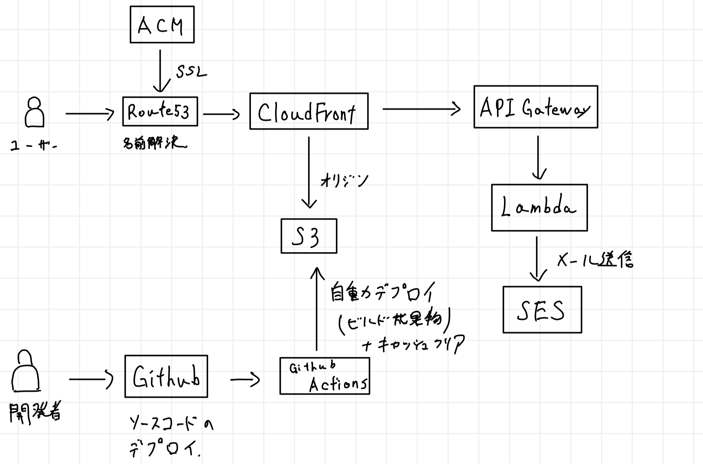

# CDK サーバレス静的サイトサンプル | タイムテーブル式予約用アプリ

## 構成図

## 概要

- タイムテーブル式の予約アプリのサンプル
- 画面で申し込みすると予約を受けつけた旨のメールがドメインから自動送信される仕組み
- フロントエンドはVue.js v3を使用しGithubのmainブランチへのマージによりGithub Actionsでビルド、S3へのデプロイが自動化される。
- バックエンドにはAPIGateway, Lambda, SESを使用し、バックエンドのデプロイもCDKで行っている。こちらは自動化していないが、会社でやるならCodeシリーズで自動化し、差分を確認してマージするなどの運用が可能

## 技術スタック｜依存ライブラリ

### フロントエンド

- Vue.js v3
- TypeScript
- vite
- vue-cal ... カレンダー用ライブラリ
- ress ... リセットCSS

### バックエンド

- SES
- Lambda
- ApiGateway

### インフラ

- AWS CDK
- biome ... Linter, Formatter
- dotenv ... 環境変数参照用

### 全体に関係するもの

- CICD:Github Actions
  - biomeによる静的解析(CDK側 push時)
  - S3への自動デプロイ

## CDKで実装したインフラの概要

- APIGateway , Lambda, SESによるバックエンド
- S3, CloudFrontによるビルド成果物のホスティング
- Github ActionsとIAMの連携用OICD設定（IAM関連）

## 注意点

- scr以下がフロントエンドの実装となる。
  - パスに注意すること

## デプロイの流れ

1. `cdk bootstrap`
2. `cdk deploy --all`
    - `--all`はすべてのスタックをデプロイするオプション
    - スタック名を指定して個別にデプロイすることも可能
    - 複数の環境を取り扱う場合には、--profileオプションでプロファイルを指定する
